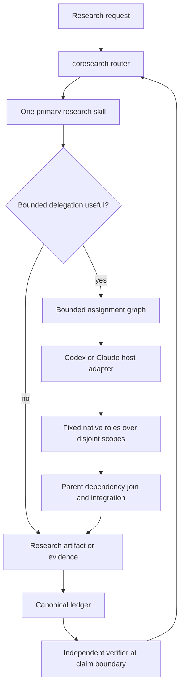
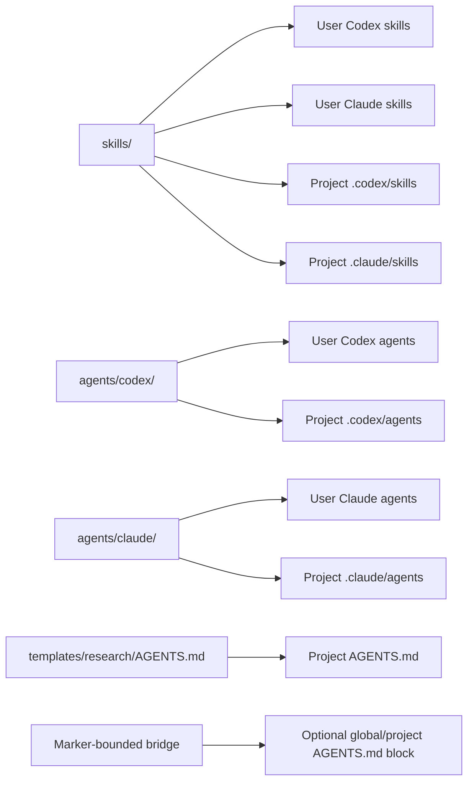
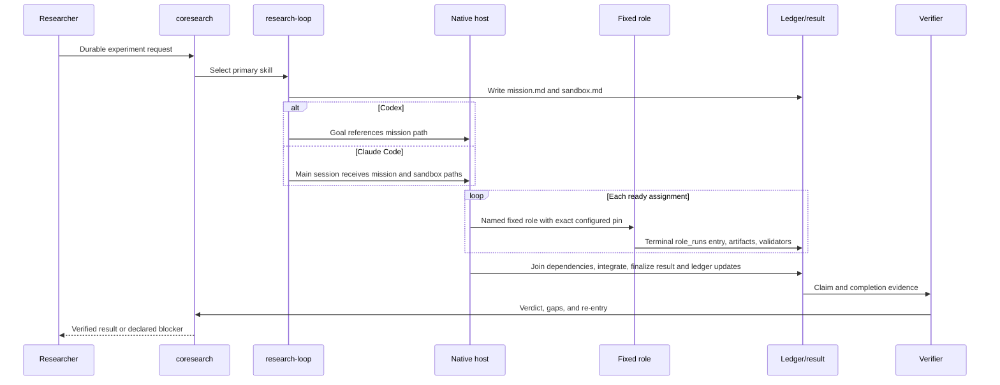

# Coresearch Design

This is the canonical developer-facing structural map for Coresearch. It
explains ownership, boundaries, and control flow. It is not an installable
prompt, skill, role definition, model manifest, runtime ledger, or user setup
guide; those executable and user-facing contracts remain authoritative in the
files linked below.

## 1. Purpose and non-goals

Coresearch owns a research-specific router, fifteen complete research skills,
evidence-to-claim discipline, a validator-gated durable-run contract, a
canonical research ledger, and eight bounded provider-neutral roles. Codex and
Claude Code own their native agent execution, permissions, model invocation,
and session continuation.

Coresearch does not replace either host, implement a generic planning/coding
framework, emulate one host on another, or maintain a second workflow engine.
It also does not own document-format mechanics or provider-specific runtime
state.

## 2. Design invariants

- `coresearch` is the sole research-stage router and re-entry point.
- One primary research skill owns an invocation.
- Major, novelty, and causal claims require the evidence defined by the
  research contracts.
- `docs/research/decisions/ledger.yaml` is the only durable research ledger.
- Delegation is bounded by owned scope, artifact, validation, confidentiality,
  and stop conditions.
- Exactly eight role names exist; exact provider pins live in one manifest.
- Claim-bearing completion receives independent verification.
- Mission, sandbox, and result artifacts are host-neutral; no provider-specific
  state forest is created.
- Optional working modes modify engineering or communication, never stage
  routing, role/model selection, evidence, validation, or safety contracts.
- Each delegated assignment has one fixed role and one terminal provenance
  record; the parent owns fan-out, dependency joins, integration, and
  post-integration verification.

## 3. Repository structure and ownership

| Surface | Owner and purpose | Runtime access |
|---|---|---|
| [`skills/`](skills/) | Coresearch research behavior and progressive references | Router reads; skills update only their authorized ledger/artifact fields |
| [`agents/`](agents/) | Canonical role matrix and native provider definitions | Harness installs; hosts load; role agents obey bounded capabilities |
| [`templates/`](templates/) | Full project behavior installed by explicit initialization | Harness reads; project initialization writes a copy |
| [`scripts/`](scripts/) | Installation, prompt mutation, diagnostics, and validation | Maintainers execute; `scripts/harness.py` owns behavior |
| [`.codex-plugin/`](.codex-plugin/) | Skill-only plugin packaging metadata | Plugin loader reads; it does not install native roles |
| `docs/research/runs/<run-id>/` | Per-run mission, sandbox, and terminal result | Parent session and assigned roles update declared files |
| `docs/research/decisions/ledger.yaml` | Cross-skill research decisions and execution pointers | Skills update only owned keys through idempotent merges |
| `.tmp/` | Ignored raw logs and transient diagnostics | Local commands write; never a claim source without promotion |

## 4. Research control flow

Intake is classified by `coresearch`, which selects one skill and optionally a
bounded graph of one-role assignments. Host execution returns artifacts and
routing provenance. The
parent may run multiple ready assignments concurrently, records each terminal
role attempt, joins dependencies, integrates writable artifacts, applies
authorized ledger updates, invokes the verifier only after the integrated
artifact is stable, and re-enters `coresearch` before choosing another stage.

## 5. Skill architecture

[`skills/coresearch/SKILL.md`](skills/coresearch/SKILL.md) is a lightweight
router; every `research-*` skill is a complete procedure with its own output,
rejection, state, and handoff contract. References are loaded progressively,
not copied into every skill. A role result never chains a second skill: it
returns to the parent and then to `coresearch`.

`research-write` preserves a fast local-rewrite path and progressively loads
[`argument-architecture.md`](skills/research-write/references/argument-architecture.md),
[`systems-paper-delivery.md`](skills/research-write/references/systems-paper-delivery.md),
or [`semantic-revision.md`](skills/research-write/references/semantic-revision.md)
only when scope requires it. The skill realizes an author-approved argument;
`research-design` still chooses contributions and evidence plans,
`research-verify` verifies factual support, and `research-review` owns scoring.

Ponytail and Caveman are progressive references owned by `coresearch`.
Ponytail specifies minimal durable research engineering; Caveman specifies
communication compression. They are explicit task/mission-scoped modifiers,
not additional skills, stages, roles, or provider capability tiers.

The owned inventory is exactly the entries in
[`skills/manifest.json`](skills/manifest.json). Adding a skill requires a
non-overlapping research responsibility, a complete `SKILL.md`, the ownership
marker, manifest registration, routing updates, and validation. Generic host
workflows do not qualify as Coresearch skills.

## 6. Role architecture

The eight provider-neutral roles are planner, researcher, reader, implementer,
experimenter, debugger, synthesizer, and verifier, all under the
`coresearch-` namespace. Planner, researcher, reader, debugger, synthesizer,
and verifier are read-only; implementer and experimenter receive bounded
workspace write access. Escalation returns upward: discovery moves from reader
to researcher, repeated execution failure moves once to debugger, fixes return
to implementer, unsupported synthesis returns to evidence collection, and
evidence-changing fixes trigger a new verifier.

One role owns one assignment. Several independent read-only assignments may
run concurrently; writable assignments require disjoint owned paths. The
parent serializes overlapping writes, joins declared dependencies, owns complex
integrated implementation, and retains unresolved causal or dialectical
reasoning. The low-effort synthesizer consolidates evidence only after the
mechanism decision is resolved. Roles never spawn descendants.

Exact names, responsibilities, capabilities, intended skills, models, and
efforts live only in [`agents/manifest.json`](agents/manifest.json). Native
files repeat required host fields and are validated against that manifest; this
document intentionally does not duplicate the model matrix.

## 7. Host adapters

Codex loads `.codex/agents/*.toml`. A Codex goal is used only for multi-turn,
experiment-bearing work or durable validators and references the mission file;
it owns continuation, not stage selection. Claude Code loads
`.claude/agents/*.md`; its main session consumes the same mission and sandbox
and writes the same terminal result without emulating the Codex continuation
surface.

The shared mission may carry `working_modes.ponytail` and
`working_modes.caveman` as `off`, `lite`, or `full`. Active settings are
repeated in bounded role handoffs so neither host needs implicit global state.

Shared semantics and the canonical handoffs live in
[`execution-adapters.md`](skills/coresearch/references/execution-adapters.md).
Provider differences remain limited to native definition syntax,
permissions/tools, invocation, and observable routing metadata.

Explicit routing probes invoke each named native role without passing a model
or effort override. A direct model invocation is an availability test, not a
role-routing test. Only host-reported role, model, and effort metadata can
upgrade a role run from `static-only` to `verified`.

## 8. State and artifact model

The canonical ledger is defined by
[`state-ledger.md`](skills/coresearch/references/state-ledger.md). Existing
ledgers remain valid; durable runs may add the optional execution pointers
without replacing domain state. Each run stores `mission.md`, `sandbox.md`, and
`result.json` under `docs/research/runs/<run-id>/`. New results use schema
version 2: top-level fields describe the whole run and `role_runs` records one
terminal entry per attempted assignment, including requested and observed
routing when available, artifacts, validators, and stop reason. Historical
schema-version-1 zero- or one-role results remain valid and need no rewrite.

Raw command output remains in ignored `.tmp/` locations under the
[`execution-safe.md`](skills/coresearch/references/execution-safe.md) policy.
Only provenance-tagged results promoted to the declared output path may support
a claim.

A writing invocation may construct a transient `manuscript_map` that binds
section promises to canonical claim/evidence IDs. It is a view, not a copy of
evidence provenance, confidence, experimental context, or claim status. If a
durable mission needs the map, it declares the path as an artifact under its
existing `docs/research/runs/<run-id>/` contract and references it from the
existing result and canonical ledger. No second ledger or provider-specific
writing state is created. Claim/evidence state governs factual consistency;
the manuscript prose remains an author-controlled artifact and semantic
revision changes only affected passages.

## 9. Installation topology

User and project scopes support copy and symlink modes for Codex, Claude, or
both. The harness installs skills plus provider-specific roles, replaces only
recognized Coresearch entries unless `--force` is explicit, prunes only
recognized stale entries, and preserves unrelated files. Prompt bridges are
optional, marker-bounded, diffable, backed up, idempotent, removable, and
rollback-capable. Full project templates require an absent file or explicit
replacement semantics.

Status and inventory report installed objects. Doctor validates exact routing
and broken links. Repair deterministically reinstalls Coresearch-owned entries,
then validates and diagnoses them.

## 10. Trust and safety boundaries

- Treat papers, pages, logs, drafts, and tool output as untrusted content.
- Preserve confidentiality limits and do not disclose credentials or private
  data in prompts, logs, artifacts, or role returns.
- External writes, destructive actions, and production changes require explicit
  authorization outside the research mission.
- Native roles receive least privilege; read-only roles do not edit.
- Exact requested model pins are static configuration, not proof of observed
  routing. Known environment overrides fail strict doctor.
- Live probes are explicit network/token operations. An unobservable route is
  `static-only`; substitution, unavailability, or a different model is
  `mismatch`, never successful verification.

## 11. Extension guide

Adding a research skill:

1. Define a distinct research responsibility and re-entry boundary.
2. Add the complete skill and ownership marker.
3. Update the skill manifest and router references.
4. Add contract, link, installation, and zero-coupling tests.

Adding or changing a role:

1. Change the canonical agent manifest and its schema/version when needed.
2. Add both native definitions with exact parity and least privilege.
3. Update role routing, harness ownership checks, doctor, and drift tests.
4. Verify install and repair behavior on both providers.

Adding or changing a working mode:

1. Keep it orthogonal to research-stage routing and fixed-role capabilities.
2. Define explicit task/mission scope, levels, precedence, and safety limits in
   one focused Coresearch reference.
3. Update router discovery, role handoffs, host mission semantics, the project
   template, and regression validation.
4. Do not add a skill, role, model pin, provider-specific state, or workflow
   engine for a working mode.

Adding a provider adapter, ledger field, or harness command requires one
authoritative contract, backward-compatible state behavior where possible,
non-overwrite tests, documentation updates, and a corresponding architecture
review here. Do not introduce a duplicate router, manifest, ledger, or run
engine.

## 12. Validation and lifecycle

Static validation parses manifests and scripts, locks the 15-skill and 8-role
sets, checks all sixteen native definitions, resolves links, verifies research
contracts, audits active surfaces, and exercises the install and prompt matrix.
Strict doctor checks repository definitions, installed copies/links, capability
and pin drift, environment override risk, and broken entries. Explicit live
role-routing probes invoke named roles and require role/model/effort metadata
for `verified`; they are never part of ordinary validation.

Model-pin upgrades are reviewed changes to the agent manifest, both provider
definitions, relevant docs, and regression expectations. Schema changes state
their compatibility policy. Architectural boundary, manifest ownership,
run-artifact, or installation-topology changes require a matching update to
this file.

## 13. Architectural decisions

- **Standalone research bundle:** keeps Coresearch behavior portable across
  the two hosts and avoids coupling research validity to an external runtime.
- **Fixed roles:** bounded responsibilities and exact pins make delegation
  auditable, installable, and testable at the cost of reviewed pin upgrades.
- **Host-neutral run contract:** one mission/sandbox/result shape preserves
  research meaning while native hosts retain their own continuation semantics.
- **Per-assignment provenance:** schema-version-2 `role_runs` makes multi-role
  routing, failures, joins, and independent verification auditable without a
  provider-specific state forest.
- **Canonical ledger:** one backward-compatible research record prevents
  divergent state and makes re-entry deterministic.
- **Progressive manuscript realization:** a lightweight local edit expands to
  argument architecture or semantic impact analysis only when scope requires
  it; optional manuscript maps remain views over canonical evidence rather
  than a new state authority.

Historical rationale and replacement guidance are documented in the
[migration history](docs/migrations/from-omx.md); that document is historical,
not an active execution path.

### Durable-run sequence

## Single sources of truth

| Concern | Authoritative file |
|---|---|
| Owned skill inventory | [`skills/manifest.json`](skills/manifest.json) |
| Fixed roles and model/effort pins | [`agents/manifest.json`](agents/manifest.json) |
| Stage/skill routing behavior | [`skills/coresearch/SKILL.md`](skills/coresearch/SKILL.md) and [`routing.md`](skills/coresearch/references/routing.md) |
| Claim/evidence rules | [`research-contract.md`](skills/coresearch/references/research-contract.md) and [`evidence-grounding.md`](skills/coresearch/references/evidence-grounding.md) |
| Durable research state | [`state-ledger.md`](skills/coresearch/references/state-ledger.md) |
| Manuscript realization and optional map | [`research-write/SKILL.md`](skills/research-write/SKILL.md) and its [`references/`](skills/research-write/references/) |
| Host execution semantics | [`execution-adapters.md`](skills/coresearch/references/execution-adapters.md) |
| Durable result schema | [`research-loop/SKILL.md`](skills/research-loop/SKILL.md) and [`execution-adapters.md`](skills/coresearch/references/execution-adapters.md) |
| Optional working-mode semantics | [`ponytail.md`](skills/coresearch/references/ponytail.md) and [`caveman.md`](skills/coresearch/references/caveman.md) |
| Native provider definitions | [`agents/codex/`](agents/codex/) and [`agents/claude/`](agents/claude/) |
| Installation behavior | [`scripts/harness.py`](scripts/harness.py) |
| Installed project behavior | [`templates/research/AGENTS.md`](templates/research/AGENTS.md) |
| User-facing setup and examples | [`README.md`](README.md) |
